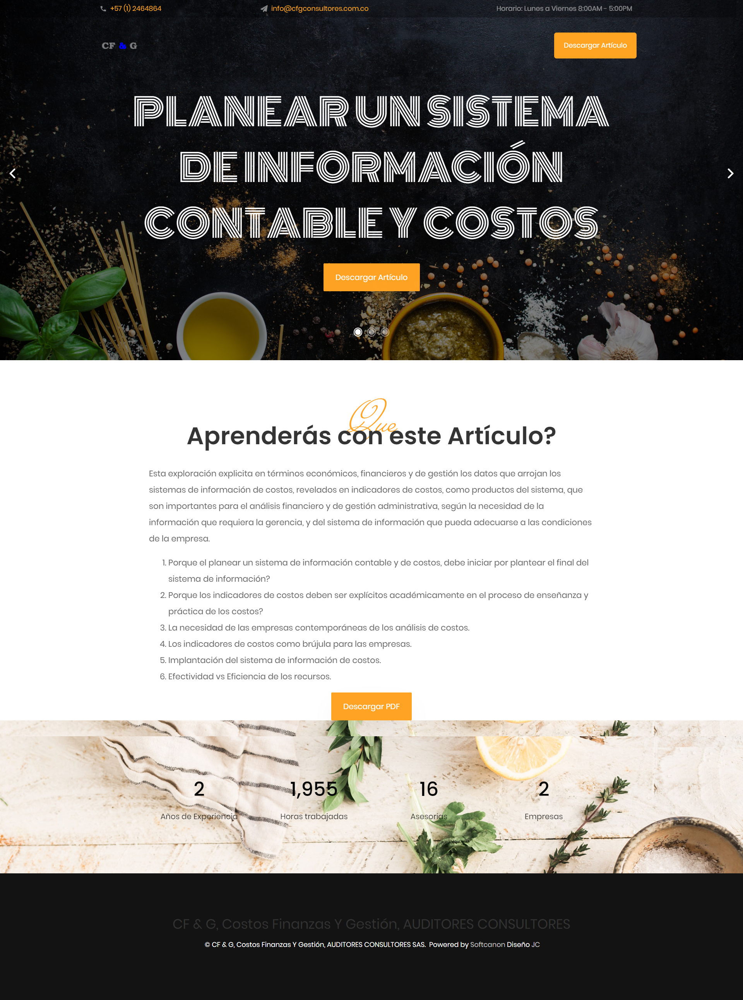

# cfgconsultores.com.co
HTML5 Bootstrap responsive website.

--- 
## Technology and Frameworks Used

* Bootstrap 4.x
* Jquery 3.x
* Microsoft Internet Server IIS 10
* Microsoft Visual Studio 2019
* Paint.net
* Inkscape
* FileZilla

## Philosophy of Javier Cañon

* KISS by design and programming. An acronym for "keep it simple, stupid" or "keep it stupid simple", is a design principle. The KISS principle states that most systems work best if they are kept simple rather than made complicated; therefore, simplicity should be a key goal in design, and unnecessary complexity should be avoided. Variations on the phrase include: "Keep it simple, silly", "keep it short and simple", "keep it simple and straightforward", "keep it small and simple", or "keep it stupid simple".
* Select the best tools for the job, use tools that take less time to finish the job.
* Productivity over complexity and avoid unnecessary complexity for elegant or beauty code.
* Computers are machines, more powerful every year, give them hard work, concentrate on being productive.
* Often people, especially computer engineers, focus on the machines. They think, "By doing this, the machine will run fast. By doing this, the machine will run more effectively. By doing this, the machine will something, something, something..." They are focusing on machines. But in fact we need to focus on humans, on how humans care about doing programming or operating the application of the machines. We are the masters. They are the slaves. [Yukihiro Matsumoto].

## Website

## Landing Pages

Integrated with Mailerlite (Email Marketing)

## License

This project is licensed under the CC0 License - see the [LICENSE](LICENSE) file for details.

---
Made with ❤️ by **[Javier Cañon](https://javiercanon.com)**.
